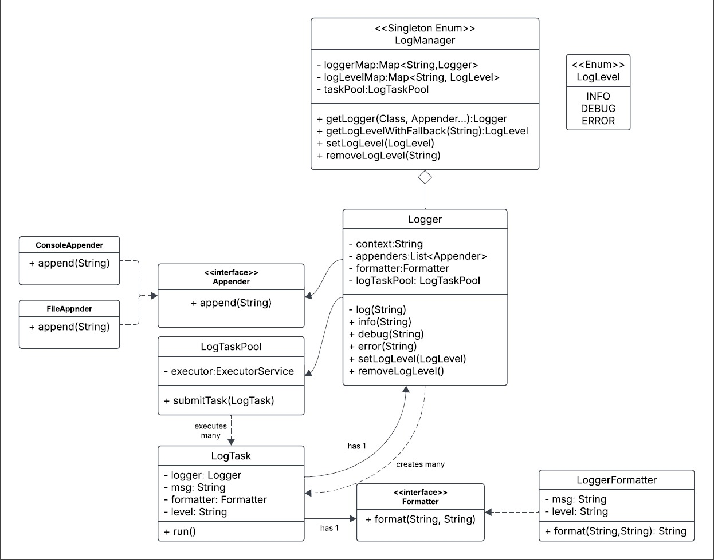

# Logger Application

This is a simple logging framework written in **Java (JDK 21)** using **Maven** for dependency management.

## **Prerequisites**

Ensure you have the following installed on your system:

- **JDK 21** ([Download](https://www.oracle.com/il-en/java/technologies/downloads/#java21)) 
 or download it through **Project Structure** if you are using Intelij IDE (I used azul-21 SDK).
- **Language level**: SDK default

- **Apache Maven** ([Download](https://maven.apache.org/download.cgi)) or use the built-in Intellij maven tool box

### **Check Installed Versions**  **(Skip if use built-in intellij maven + JDK)**
If you don't use the Intellij options, run the following commands to verify your setup:

```shell
java -version
mvn -version
```
- If you are using IntelliJ, run in the maven tool box **mvn clean install**, if not run same command in the terminal.
- Make sure target directory created.
- **I submitted the assignment with the target directory to make life easier :)
 I know it can be easily rebuild with maven and pom.xml.
 since it's lightweight and contains JAR as well (optional for running purposes) even though it's not best practice and not recommended at all for larger projects.**
- Run Main function if using Intellij, otherwise in terminal:
```shell
mvn exec:java -Dexec.mainClass="com.logger.Main"
```
**NOTE** 

In the assignment I addressed to log level hierarchy as follows:
INFO --> DEBUG --> ERROR as written in instructions although convention AFAIK is 
DEBUG --> INFO etc. 


**UML Class Diagram**



